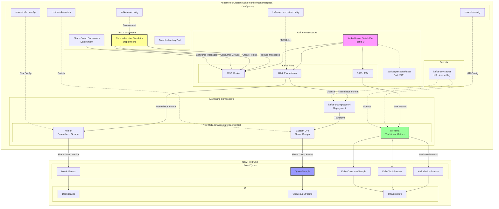

```mermaid
graph TB
    subgraph "Kubernetes Cluster (kafka-monitoring namespace)"
        subgraph "Kafka Infrastructure"
            ZK[Zookeeper StatefulSet<br/>Port: 2181]
            KAFKA[Kafka Broker StatefulSet<br/>kafka-0]
            
            subgraph "Kafka Ports"
                P1[9092: Broker]
                P2[9999: JMX]
                P3[9404: Prometheus]
            end
            
            KAFKA --> P1
            KAFKA --> P2
            KAFKA --> P3
            KAFKA -.-> ZK
        end
        
        subgraph "Monitoring Components"
            subgraph "New Relic Infrastructure DaemonSet"
                NRIK[nri-kafka<br/>Traditional Metrics]
                NRIFLEX[nri-flex<br/>Prometheus Scraper]
                OHI[Custom OHI<br/>Share Groups]
            end
            
            NRIOHI[kafka-sharegroup-ohi<br/>Deployment]
        end
        
        subgraph "Test Components"
            SIM[Comprehensive Simulator<br/>Deployment]
            SGC[Share Group Consumers<br/>Deployment]
            TOOLS[Troubleshooting Pod]
        end
        
        subgraph "ConfigMaps"
            CM1[kafka-env-config]
            CM2[newrelic-config]
            CM3[newrelic-flex-config]
            CM4[custom-ohi-scripts]
            CM5[kafka-jmx-exporter-config]
        end
        
        subgraph "Secrets"
            S1[kafka-env-secret<br/>NR License Key]
        end
    end
    
    subgraph "New Relic One"
        subgraph "Event Types"
            KBS[KafkaBrokerSample]
            KTS[KafkaTopicSample]
            KCS[KafkaConsumerSample]
            QS[QueueSample]
            M[Metric Events]
        end
        
        subgraph "UI"
            DASH[Dashboards]
            QSU[Queues & Streams]
            INF[Infrastructure]
        end
    end
    
    %% Data Flow - Kafka Metrics
    P2 -->|JMX Metrics| NRIK
    NRIK -->|Traditional Metrics| KBS
    NRIK --> KTS
    NRIK --> KCS
    
    %% Data Flow - Prometheus Metrics
    P3 -->|Prometheus Format| NRIFLEX
    NRIFLEX -->|Share Group Metrics| M
    
    %% Data Flow - Custom OHI
    P3 -->|Prometheus Format| NRIOHI
    NRIOHI -->|Transform| OHI
    OHI -->|Share Group Events| QS
    
    %% Test Data Generation
    SIM -->|Produce Messages| P1
    SIM -->|Create Topics| P1
    SIM -->|Consumer Groups| P1
    SGC -->|Consume Messages| P1
    
    %% Configuration Dependencies
    CM1 -.->|Environment| SIM
    CM2 -.->|NRI Config| NRIK
    CM3 -.->|Flex Config| NRIFLEX
    CM4 -.->|Scripts| OHI
    CM5 -.->|JMX Rules| P3
    S1 -.->|License| NRIK
    S1 -.->|License| NRIOHI
    
    %% UI Connections
    KBS --> INF
    KTS --> INF
    KCS --> INF
    QS --> QSU
    M --> DASH
    
    style KAFKA fill:#f9f,stroke:#333,stroke-width:2px
    style NRIK fill:#9f9,stroke:#333,stroke-width:2px
    style QS fill:#99f,stroke:#333,stroke-width:2px
    style SIM fill:#ff9,stroke:#333,stroke-width:2px
```
