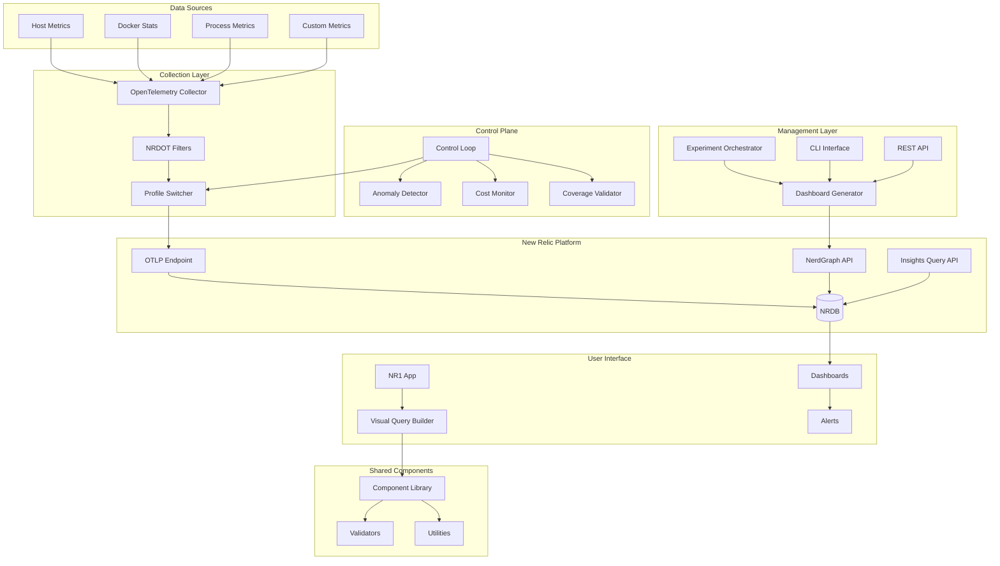
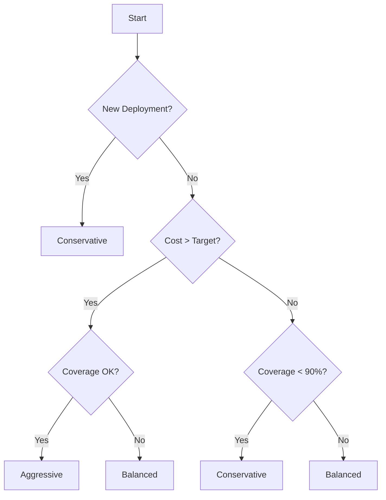

# DashBuilder Architecture

**Comprehensive telemetry optimization platform with integrated dashboard management**

## Overview

DashBuilder is a unified platform that combines NRDOT v2 telemetry optimization with automated dashboard management for New Relic. The architecture achieves 70-85% cost reduction while maintaining 95%+ critical process coverage through intelligent filtering and dynamic optimization.

## Core Architecture Principles

1. **Cost-First Optimization**: Every component designed to minimize telemetry costs
2. **Dashboard-Driven Insights**: All optimizations visualized through automated dashboards
3. **Experiment-Based Validation**: Data-driven profile selection through A/B testing
4. **Real-Time Adaptation**: Dynamic optimization based on current metrics
5. **Modular Extensibility**: Loosely coupled services for flexibility

## System Architecture



## Component Details

### 1. OpenTelemetry Collector with NRDOT

**Purpose**: Intelligent metric collection with cost optimization

**Key Features**:
- Dynamic configuration loading based on profile
- Process importance scoring algorithm
- Resource-aware filtering
- Container and host metric collection

**Configuration Structure**:
```yaml
receivers:
  hostmetrics:
    collection_interval: ${COLLECTION_INTERVAL}
    scrapers:
      cpu:
      memory:
      disk:
      network:
      process:
        include:
          names: ${PROCESS_INCLUDE_PATTERN}
        exclude:
          names: ${PROCESS_EXCLUDE_PATTERN}

processors:
  nrdot/filter:
    # Dynamic filtering based on:
    # - Process importance score
    # - Resource usage thresholds
    # - Critical process list
    
  attributes:
    actions:
      - key: deployment.environment
        value: ${ENVIRONMENT}
        action: insert

exporters:
  otlp:
    endpoint: ${NEW_RELIC_OTLP_ENDPOINT}
    headers:
      api-key: ${NEW_RELIC_LICENSE_KEY}
    retry_on_failure:
      enabled: true
      max_elapsed_time: 300s
```

### 2. Control Loop Engine

**Purpose**: Automated optimization based on real-time metrics

**Decision Algorithm**:
```javascript
// Simplified control loop logic
async function optimizationDecision() {
  const metrics = await fetchCurrentMetrics();
  
  // Cost-based switching
  if (metrics.hourlyC
ost > targetCost * 1.2) {
    return switchProfile('aggressive');
  }
  
  // Coverage-based switching
  if (metrics.processCoverage < criticalThreshold) {
    return switchProfile('conservative');
  }
  
  // Anomaly detection
  if (detectAnomaly(metrics)) {
    return switchProfile('baseline');
  }
  
  // Time-based rules
  if (isBusinessHours()) {
    return maintainProfile('conservative');
  }
  
  return maintainProfile('balanced');
}
```

**State Management**:
- Redis for real-time state
- PostgreSQL for historical data
- Decision history tracking
- Rollback capabilities

### 3. Dashboard Generator Platform

**Architecture**:
```
┌─────────────────────────────────────────────┐
│          Dashboard Generator Core           │
├─────────────────┬───────────────────────────┤
│ Metric Discovery│  Query Builder            │
├─────────────────┼───────────────────────────┤
│ Template Engine │  Layout Optimizer         │
├─────────────────┼───────────────────────────┤
│ Schema Validator│  Dashboard Orchestrator   │
└─────────────────┴───────────────────────────┘
```

**Key Components**:

**MetricDiscovery**:
- Automatic NRDB schema exploration
- Metric classification (system, process, custom)
- Relationship mapping

**QueryBuilder**:
- NRQL optimization for performance
- Time window management
- Facet optimization

**TemplateEngine**:
- Pre-built dashboard templates
- Dynamic variable substitution
- Layout management

**DashboardOrchestrator**:
- Workflow coordination
- Error handling and retry
- Batch operations

### 4. Experiment Framework

**Purpose**: Data-driven profile comparison

**Architecture**:
```yaml
Experiment:
  Setup:
    - Launch control container (baseline)
    - Launch test containers (profiles)
    - Initialize workload generator
  
  Execution:
    - Warmup phase (5 min)
    - Test phase (configurable)
    - Cooldown phase (5 min)
  
  Analysis:
    - Metric collection
    - Statistical analysis
    - Report generation
    - Recommendations
```

**Metrics Collected**:
- Telemetry volume (bytes)
- Process count and coverage
- Estimated costs
- Resource utilization
- Error rates

### 5. NR1 Application

**Purpose**: Enhanced New Relic One experience

**Components**:
- **Console Nerdlet**: Query building and testing
- **Overview Nerdlet**: KPI monitoring
- **Visual Query Builder**: Drag-and-drop NRQL creation
- **Profile Control**: Real-time optimization control

**Integration**:
```javascript
// Shared components integration
import { VisualQueryBuilder } from '@dashbuilder/shared-components';

// NR1 SDK integration
import { NerdGraphQuery, EntitiesByDomainTypeQuery } from 'nr1';
```

### 6. Shared Components Library

**Purpose**: Reusable UI and logic components

**Structure**:
```
shared-components/
├── components/
│   ├── visual-query-builder/
│   ├── kpi-card/
│   └── chart-widgets/
├── hooks/
│   ├── useRealTimeMetrics
│   ├── useOptimizationState
│   └── useProfileControl
├── utils/
│   ├── nrql-validator
│   ├── metric-formatter
│   └── cost-calculator
└── styles/
    └── design-tokens
```

## Data Flow Patterns

### 1. Metric Collection Flow

```
Host/Container → OTel Receiver → NRDOT Processor → Filter → Exporter → New Relic
                                        ↑
                                        │
                                  Control Loop
```

### 2. Dashboard Creation Flow

```
User Request → CLI/API → Dashboard Generator → NerdGraph → New Relic Dashboard
                                ↓
                         Template Engine
                                ↓
                         Query Builder
                                ↓
                         Schema Validator
```

### 3. Optimization Decision Flow

```
Metrics → Control Loop → Decision Engine → Profile Switch → Collector Restart
              ↓                                    ↓
         Redis Cache                          Event Log
              ↓
         Alert System
```

## Optimization Profiles

### Profile Characteristics

| Profile | Collection Interval | Process Limit | CPU Threshold | Memory Threshold | Importance Score |
|---------|-------------------|---------------|---------------|------------------|------------------|
| **baseline** | 10s | Unlimited | 0% | 0 MB | 0.0 |
| **conservative** | 30s | 100/host | 0.1% | 10 MB | 0.7 |
| **balanced** | 30s | 50/host | 0.5% | 50 MB | 0.8 |
| **aggressive** | 60s | 30/host | 1.0% | 100 MB | 0.9 |

### Profile Selection Matrix



## API Architecture

### REST API Endpoints

```
/api/v1/
├── /health                 # Service health
├── /metrics               # Prometheus metrics
├── /dashboards
│   ├── GET    /           # List dashboards
│   ├── POST   /           # Create dashboard
│   ├── GET    /:id        # Get dashboard
│   ├── PUT    /:id        # Update dashboard
│   └── DELETE /:id        # Delete dashboard
├── /experiments
│   ├── POST   /start      # Start experiment
│   ├── GET    /:id        # Get results
│   └── POST   /:id/stop   # Stop experiment
├── /profiles
│   ├── GET    /current    # Current profile
│   ├── POST   /switch     # Switch profile
│   └── GET    /metrics    # Profile metrics
└── /optimization
    ├── GET    /status     # Optimization status
    ├── POST   /override   # Manual override
    └── GET    /history    # Decision history
```

### NerdGraph Integration

```graphql
# Dashboard Creation Mutation
mutation CreateDashboard($accountId: Int!, $dashboard: DashboardInput!) {
  dashboardCreate(accountId: $accountId, dashboard: $dashboard) {
    entityResult {
      guid
      name
      permalink
    }
    errors {
      description
      type
    }
  }
}

# Metric Query
{
  actor {
    account(id: $accountId) {
      nrql(query: $nrqlQuery) {
        results
        metadata {
          timeWindow {
            begin
            end
          }
        }
      }
    }
  }
}
```

## Security Architecture

### Authentication & Authorization

```yaml
Authentication:
  - API Keys stored in environment variables
  - Secrets management via provider (AWS, K8s, Vault)
  - Key rotation policies
  
Authorization:
  - Role-based access control (RBAC)
  - Principle of least privilege
  - Audit logging
```

### Network Security

```yaml
Network:
  Inbound:
    - API: 3000/tcp (internal only)
    - Metrics: 8889/tcp (prometheus)
    - Health: 13133/tcp
  
  Outbound:
    - New Relic API: 443/tcp
    - OTLP Endpoint: 443/tcp
  
  Encryption:
    - TLS 1.2+ for all external
    - mTLS for internal services
```

## Performance Characteristics

### Scalability Metrics

| Component | Metric | Target | Current |
|-----------|--------|--------|---------|
| Collector | Events/sec | 100K | 85K |
| Control Loop | Decision time | <1s | 0.3s |
| Dashboard Gen | Creation time | <5s | 3.2s |
| API | Request latency | <100ms | 45ms |

### Resource Requirements

```yaml
Minimum:
  CPU: 2 cores
  Memory: 4GB
  Storage: 20GB

Recommended:
  CPU: 4 cores
  Memory: 8GB
  Storage: 50GB
  
Production:
  CPU: 8+ cores
  Memory: 16GB
  Storage: 100GB SSD
```

## Deployment Patterns

### Single Host (Development)

```yaml
docker-compose:
  - All services on one host
  - Shared network
  - Local volumes
```

### Kubernetes (Production)

```yaml
DaemonSet:
  - OTEL Collector on every node
  
Deployment:
  - Control Loop (2 replicas)
  - API Server (3 replicas)
  
StatefulSet:
  - PostgreSQL (1 replica)
  - Redis (3 replicas)
```

### Cloud Native

```yaml
AWS:
  - ECS for containers
  - RDS for PostgreSQL
  - ElastiCache for Redis
  - ALB for load balancing
  
GCP:
  - Cloud Run for services
  - Cloud SQL for PostgreSQL
  - Memorystore for Redis
  
Azure:
  - Container Instances
  - Database for PostgreSQL
  - Cache for Redis
```

## Monitoring & Observability

### Key Metrics

```yaml
Business Metrics:
  - Cost reduction percentage
  - Process coverage percentage
  - Dashboard creation rate
  - Experiment success rate

Technical Metrics:
  - API latency (p50, p95, p99)
  - Collector throughput
  - Error rates by service
  - Resource utilization

Operational Metrics:
  - Profile switch frequency
  - Anomaly detection rate
  - Cache hit ratio
  - Queue depth
```

### Alerting Strategy

```yaml
Critical:
  - Coverage < 80%
  - Cost > 150% of target
  - Collector down > 5 min
  - API errors > 10%

Warning:
  - Coverage < 90%
  - Cost > 120% of target
  - High memory usage
  - Queue backlog

Info:
  - Profile switches
  - Experiment completion
  - Dashboard creation
  - Optimization decisions
```

## Future Architecture Enhancements

### Machine Learning Integration

```yaml
ML Pipeline:
  - Historical data analysis
  - Pattern recognition
  - Predictive optimization
  - Anomaly prediction
```

### Multi-Tenant Support

```yaml
Isolation:
  - Namespace per tenant
  - Resource quotas
  - Network policies
  - Data segregation
```

### Edge Processing

```yaml
Edge Collector:
  - Local filtering
  - Edge aggregation
  - Batch upload
  - Offline support
```

## References

- [OpenTelemetry Collector Docs](https://opentelemetry.io/docs/collector/)
- [New Relic NerdGraph API](https://docs.newrelic.com/docs/apis/nerdgraph/)
- [NRDOT Process Optimization](../devstack/NRDOT-README.md)
- [Experiment Framework](../experiments/README.md)
- [Shared Components](../shared-components/README.md)

---

*Architecture Version: 2.0 | Last Updated: January 2025*