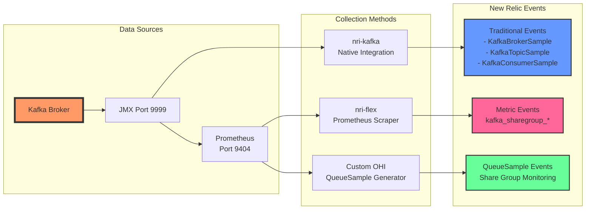

```mermaid
graph LR
    subgraph "Data Sources"
        K[Kafka Broker]
        JMX[JMX Port 9999]
        PROM[Prometheus<br/>Port 9404]
    end
    
    subgraph "Collection Methods"
        NRI[nri-kafka<br/>Native Integration]
        FLEX[nri-flex<br/>Prometheus Scraper]
        OHI[Custom OHI<br/>QueueSample Generator]
    end
    
    subgraph "New Relic Events"
        TRAD[Traditional Events<br/>- KafkaBrokerSample<br/>- KafkaTopicSample<br/>- KafkaConsumerSample]
        METRICS[Metric Events<br/>kafka_sharegroup_*]
        QUEUE[QueueSample Events<br/>Share Group Monitoring]
    end
    
    K --> JMX
    JMX --> NRI
    JMX --> PROM
    
    NRI --> TRAD
    PROM --> FLEX
    PROM --> OHI
    
    FLEX --> METRICS
    OHI --> QUEUE
    
    style K fill:#f96,stroke:#333,stroke-width:4px
    style QUEUE fill:#6f9,stroke:#333,stroke-width:2px
    style TRAD fill:#69f,stroke:#333,stroke-width:2px
    style METRICS fill:#f69,stroke:#333,stroke-width:2px
```
